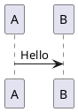

> 基于 [MarkdownIt](https://markdown-it.github.io/) 解析引擎和 [GitHub Flavored Markdown](https://github.github.com/gfm) 语法规范。

<!-- more -->

---

    这是一个段落。（强制换行）  
    这是一个段落。

这是一个段落。（强制换行）  
这是一个段落。

---

    一级标题
    =========
    二级标题
    ---------
    # 一级标题
    ## 二级标题
    ### 三级标题
    #### 四级标题
    ##### 五级标题
    ###### 六级标题

一级标题
=========
二级标题
---------
# 一级标题
## 二级标题
### 三级标题
#### 四级标题
##### 五级标题
###### 六级标题

---

    > 区块引用
    > > 嵌套引用

> 区块引用
> > 嵌套引用

---

    * 第一项
      + 第一项
      + 第二项
      + 第三项
    * 第二项
      - 第一项
      - 第二项
      - 第三项
    * 第三项
      1. 第一项
      3. 第二项
      2. 第三项

* 第一项
  + 第一项
  + 第二项
  + 第三项
* 第二项
  - 第一项
  - 第二项
  - 第三项
* 第三项
  1. 第一项
  3. 第二项
  2. 第三项

---

    ---------
    *********
    _________

---------
*********
_________

---

<pre>

    void main()
    {
        printf("Hello, Markdown.");
    }

</pre>

    void main()
    {
        printf("Hello, Markdown.");
    }

---

<pre>
<span>`</span><span>`</span><span>`</span>c
void main()
{
    printf("Hello, Markdown.");
}
<span>`</span><span>`</span><span>`</span>
</pre>

```c
void main()
{
    printf("Hello, Markdown.");
}
```

---

    |    1    |    2    |    3    |
    | :------ | :-----: | ------: |
    |  aaaaa  |  bbbbb  |  ccccc  |
    |  *ABC*  |  *123*  |  *abc*  |

|    1    |    2    |    3    |
| :------ | :-----: | ------: |
|  aaaaa  |  bbbbb  |  ccccc  |
|  *ABC*  |  *123*  |  *abc*  |

---

    - [ ] 任务 A
    - [x] 任务 B
      - [x] 任务 1
      - [x] 任务 2
      - [x] 任务 3
    - [ ] 任务 C

- [ ] 任务 A
- [x] 任务 B
  - [x] 任务 1
  - [x] 任务 2
  - [x] 任务 3
- [ ] 任务 C

---

    Definition
    : 这是一个定义。

Definition
: 这是一个定义。

---

    <https://www.baidu.com/>
    [链接](https://www.baidu.com/ "Baidu")
    [链接][link]
    
    ![图片][image]{ .fancybox .center-block }
    [锚点](#anchor "Anchor")
    [锚点][anchor]

    [link]: https://www.baidu.com/ "Baidu"
    [image]: https://www.baidu.com/img/bd_logo1.png "Baidu"
    [anchor]: #anchor "Anchor"
    锚点{ #anchor name=anchor }

<https://www.baidu.com/>
[链接](https://www.baidu.com/ "Baidu")
[链接][link]

![图片][image]{ .fancybox .center-block }
[锚点](#anchor "Anchor")
[锚点][anchor]

[link]: https://www.baidu.com/ "Baidu"
[image]: https://www.baidu.com/img/bd_logo1.png "Baidu"
[anchor]: #anchor "Anchor"
锚点{ #anchor name=anchor }

---

    这是一个脚注[^1]。

    [^1]: https://www.baidu.com/

这是一个脚注[^1]。

[^1]: https://www.baidu.com/

---

    这是一个缩写（HTML）。

    *[HTML]: Hyper Text Markup Language

这是一个缩写（HTML）。

*[HTML]: Hyper Text Markup Language

---

    H^2^，H~2~
    *斜体*，_斜体_
    **粗体**，__粗体__
    ***粗斜体***，___粗斜体___
    ~~删除~~，++插入++，==标记==
    `printf("Hello, Markdown.");`

H^2^，H~2~
*斜体*，_斜体_
**粗体**，__粗体__
***粗斜体***，___粗斜体___
~~删除~~，++插入++，==标记==
`printf("Hello, Markdown.");`

---

    \\，\`，\*，\_，\{\}，\[\]，\(\)，\#，\+，\-，\.，\!

\\，\`，\*，\_，\{\}，\[\]，\(\)，\#，\+，\-，\.，\!

---

    &，<，&copy;，:smile:，$E=mc^2$

&，<，&copy;，:smile:，$E=mc^2$

---

    $$\begin{cases}
    a_1x+b_1y+c_1z=d_1\\
    a_2x+b_2y+c_2z=d_2\\
    a_3x+b_3y+c_3z=d_3
    \end{cases}$$

$$\begin{cases}
a_1x+b_1y+c_1z=d_1\\
a_2x+b_2y+c_2z=d_2\\
a_3x+b_3y+c_3z=d_3
\end{cases}$$

---

<pre>
<span>`</span><span>`</span><span>`</span>puml
@startuml
A -> B: Hello
@enduml
<span>`</span><span>`</span><span>`</span>
</pre>



---

~~~

Do not just seek happiness for yourself. Seek happiness for all. Through kindness. Through mercy.


Every interaction is both precious and an opportunity to delight.

~~~


Do not just seek happiness for yourself. Seek happiness for all. Through kindness. Through mercy.


Every interaction is both precious and an opportunity to delight.


---

~~~

_.compact([0, 1, false, 2, '', 3]);
=> [1, 2, 3]

~~~


_.compact([0, 1, false, 2, '', 3]);
=> [1, 2, 3]


---

~~~
{% iframe https://www.baidu.com/ 100% 300 %}
~~~

{% iframe https://www.baidu.com/ 100% 300 %}

---

~~~


~~~




<style>#main article .mdui-card-content hr+figure,#main article .mdui-card-content hr+figure pre,#main article .mdui-card-content hr+pre{font-family:Consolas,Courier,'Courier New',monospace;font-weight:normal;font-style:normal;font-size:1em;line-height:1.7;background-color:#383838;color:#cecece;margin:0 0 1.2em 0;padding:0;border:1px solid #383838;border-radius:4px;white-space:pre;word-wrap:break-word;overflow:hidden;overflow-x:auto;-webkit-overflow-scrolling:touch;}#main article .mdui-card-content hr+pre{padding:12px 16px;}#main article .mdui-card-content hr+figure pre{margin:0;padding:12px 10px;border:none;}#main article .mdui-card-content hr+figure code,#main article .mdui-card-content hr+pre code{font-family:inherit;font-weight:inherit;font-style:inherit;font-size:inherit;line-height:inherit;background-color:transparent;color:inherit;margin:0;padding:0;border:none;border-radius:0;}</style>
